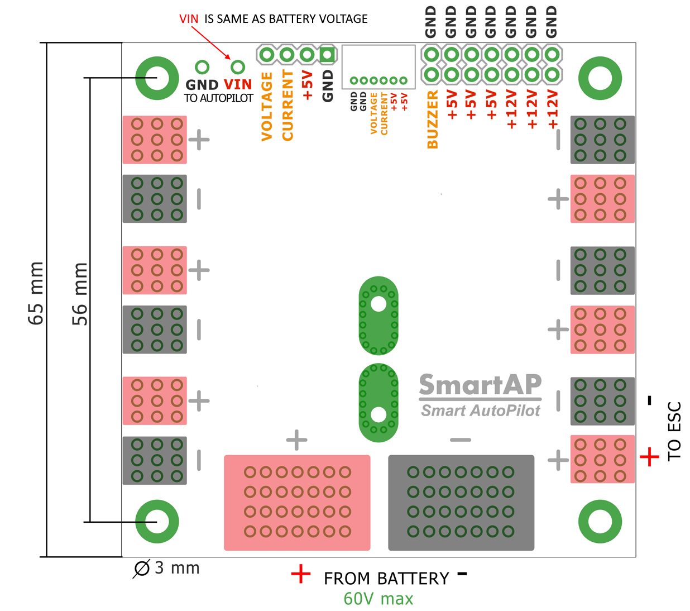
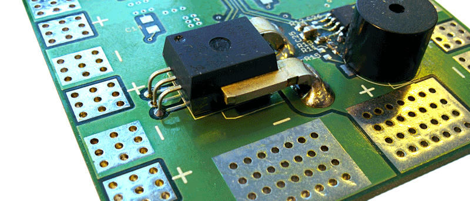

# Sky Drones SmartAP PDB

<figure><figcaption></figcaption></figure>

<figure><figcaption></figcaption></figure>

<figure><figcaption></figcaption></figure>

#### References:

* [https://ardupilot.org/copter/docs/common-smartap-pdb.html](https://ardupilot.org/copter/docs/common-smartap-pdb.html)
* [https://sky-drones.com/power/smartap-pdb.html](https://sky-drones.com/power/smartap-pdb.html)
