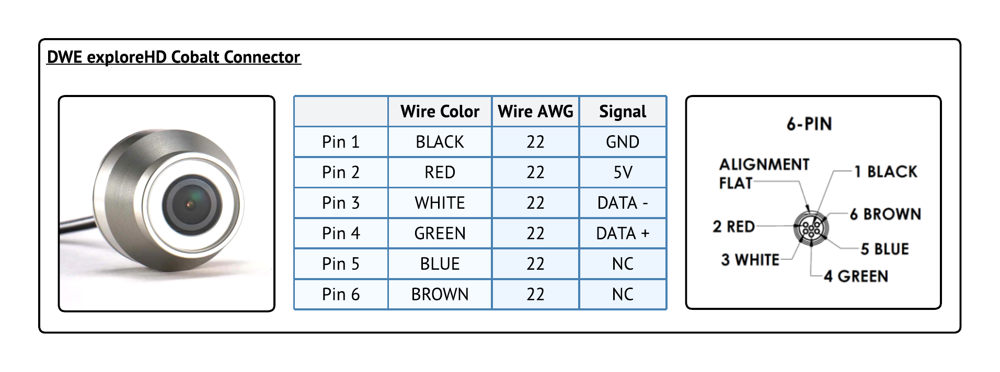

# Sensor Pinout Diagrams

The following is a pinout diagram for the DWE camera and its Cobalt 6-pin connector:

<figure><figcaption></figcaption></figure>

The following is a pinout diagram for the BR Ping Sonar and its Cobalt 6-pin connector:

<figure><figcaption></figcaption></figure>
